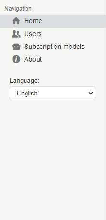
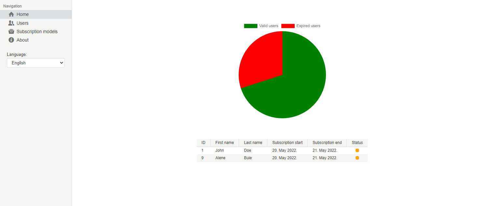
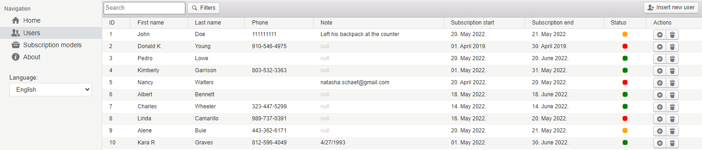
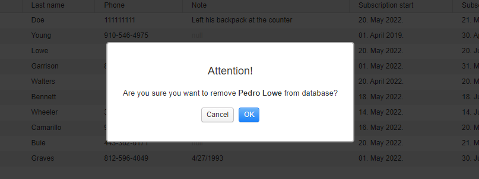
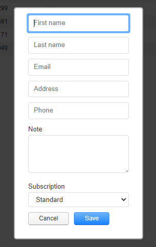
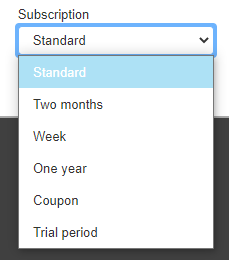
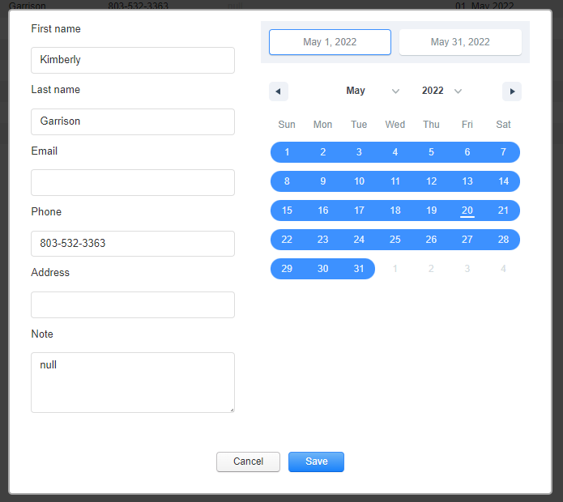
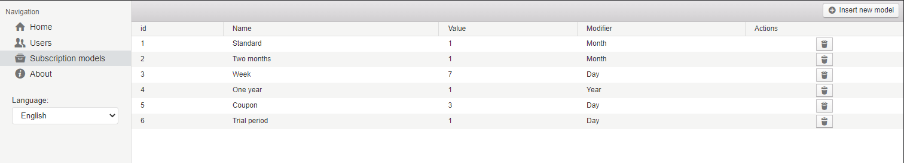
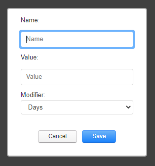
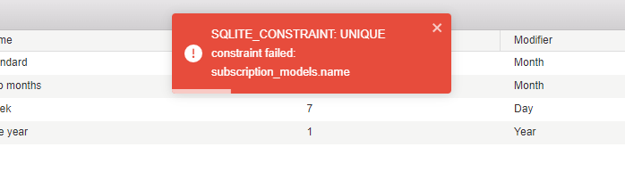

title: Macaw
created at: Fri May 20 2022 20:35:33 GMT+0000 (Coordinated Universal Time)
updated at: Fri May 20 2022 22:23:18 GMT+0000 (Coordinated Universal Time)

---

# Macaw

**Software Name: Macaw - minimal subscription-manager**

**Software Version: 1.0.0**

**Technical Information: Built with **[**electron-react-boilerplate**](https://electron-react-boilerplate.js.org/)

**Software Summary **🧠

This software is intended for keeping subscription records. The focus of the macaw is to solve the problem of record-keeping for a small business that does not need a complete solution but a simple record-keeping app. Wholly open-source and free.

**How-To Guide **🔍

To run the app locally download the repo, install the dependencies:

```bash
npm install
```

for development:

```bash
npm run start
```

If you want to package the app (build the installer ".exe"):

```bash
npm run build
```

This will output the installer to the release folder.

---

**Tutorials **🙋🏼‍♂️

### **Layout of the app**:


On the left is navigation with links to pages, and the content will be on the right.

### **Navigation**:



Here you can navigate between pages and select the language of the app.

### **Home page**:



The pie chart will show the ratio of expired and active subscriptions. The bottom table is showing subscriptions that are 3 days or less to expire sorted by most recent to expire. If there is no data this page will be blank.

---

### **Users page:**



This is a table of all users.

The table can be sorted in ascending or descending order by clicking on the header items.

In the top left corner is a search input that allows the table to be searched with a name or last name.

The table shows basic information and the status of the subscription:

- RED: expired;
- YELLOW: 3 or fewer days until expiring;
- GREEN: active

On the right are quick actions:

- PLUS: If there are subscription models it will add the first one in the list, if there are none subscription models it will add a one month from the date the subscription is set to expire;
- TRASH CAN: This will delete a user PERMANENTLY with all data. This action will trigger a confirm dialog:



In the top right corder is "add new user" button wich will open a modal to fill out the data of the new user:



First name and last name fields are only ones that are required. Note is a general field that can be used to insert and text or number.

"Subscription" select will get data from subscription models page and fill in the dropdown:



This drop down will only apply first time. Idea is to create a standard one that will be added by default when plus in the actions column of the users table is pressed and add models here for give aways or coupons or grace periods. If t he user wants some other subscription the used view can be used.

Clicking on the user will open a more detailed modal with the option to edit fields and insert custom subscriptions:



### **Subscription models**:



This is a table of all subscription models.

The table can be sorted in ascending or descending order by clicking on the header items.

The table shows information about subscription models.

On the right are quick actions:

- TRASH CAN: This will delete a user PERMANENTLY with all data. This action will trigger a confirm dialog:

Subscription model consists of name (should be as descriptive as possible), value wich is a number that is tied to modifier that can be day, month, or year.

New models are created by clicking the "Insert new model" button in the top right:



To create a new subscription that will last a week for example first we would insert new name:

- "Week sub" (name can not be duplicate and will throw a error if you try to insert a subscription with same name)
- Then we would select a value - 7 (value is a number that can not be less then 1).
- After that select modifier - days

That will give us a subscription named "Week sub" that will last for 7 days (a week).

!! **IMPORTANT:**
!! maximum amount of subscription models to add is 6. After that the button to add new one will not be functional. This is made to prevent making too much of the models.

---

- **Error message: **



If you see this message something went wrong. If you have trouble figuring it out this would be a SQL error shown so try searching on the internet. If you still have trouble you can try emailing me: [denikucevic@gmail.com](mailto:denikucevic@gmail.com).

**Customer Support **💭

If you have trouble with software, question, want some feature built in for you, something changed or want to support me you can contact me on **email**: [denikucevic@gmail.com](mailto:denikucevic@gmail.com)

or try on linkedin: [denikucevic](https://www.linkedin.com/in/denis-kucevic/)

If you are looking for the **souce code **you can find in on my github: [DeniKucevic](https://github.com/DeniKucevic/electron-mini-subscription-manager)

**Additional Comments **🔔

This app is created for my friend to help him manage his gym. I tried to best of my skills to make it as simple as possible for use and general enough for different use cases.

If you want to improve on this feel free to create a pull request and I will add you to the contributors on the github and here.

**Contributors:**

**Jón Agnar Stefánsson (JonnXor):**

- Helped keeping me sane, structuring the project and solving bugs. My work colleague and a friend of mine. Very skilled Computer scientist / programmer.
- 📍 Iceland
- 🌐 <https://jonnxor.is>
- [JonnXor@gmail.com](mailto:JonnXor@gmail.com)

---
